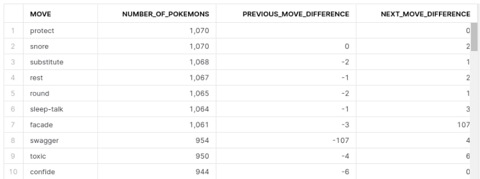
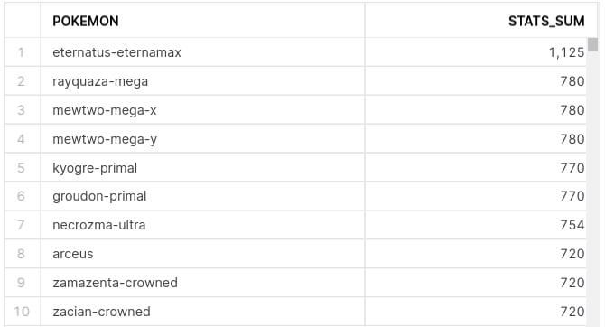
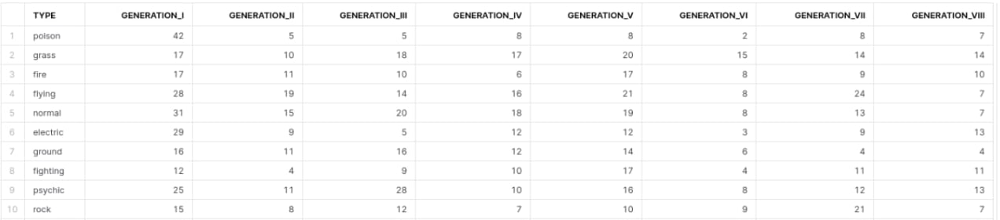

# Pokémon Data Warehouse
### Gotta Catch 'Em All!
This is my final project for Quantori Data Engineering School 2022 on Airflow (MWAA), Snowflake and DWH Architecture.
It makes use of the data from [The RESTful Pokémon API]( https://pokeapi.co/) to provide solutions to the following tasks:

1.Build Data Marts answering the following questions:  
<ol type="a">
  <li>How many Pokémons are in each type, how much less is that than the next highest ranked type? And how much more than the previous one?</li>
  <li>How many Pokémons use each move? Show the difference with the next and previous most popular move.</li>
  <li>Make a rating of Pokémons by the sum of their characteristics (stats). For example, if a Pokémon has only 2 stats: HP 20 & attack 25, then the sum of his stats going to the final rating is: 20 + 25 = 45.</li>
  <li>Show the number of Pokémons by types (table rows) and generations (table columns).</li>
</ol>
2. Run a check for the number of generations every day and keep logs of the results of the checks.

## The Project Structure
The **Airflow** folder contains the code for two DAGs:
- **check_generations** solves the second task: It downloads all the generation ids from API once per day, compares it with the latest saved data and if any changes are discovered uploads the new data to a txt file in the assigned s3 folder. The logs are printed out to the logs of the Airflow tasks.
- **download_data_from_API_to_s3** downloads via API all the data necessary to answer the questions of the firs task and writes it as json files into the assigned s3 folder.
- **utils** folder contains classes and functions used by these DAGs.  

In the common s3 folder all these files had *antr_* prefix in their names to distinguish from the other students works,
but here I deleted them, because they look too ugly. The files with antr_ prefixes in s3 have some minor differences with the version in this project.

The **Snowflake** folder contains the script used to build the Pokémon Data Warehouse.

## The Data Warehouse Structure

The built DWH has 3 layers:

1. `staging` contains snowpipes, tables containing json files from the s3 bucket and streams on these tables.
2. `storage` contains the tasks transferring the raw data from `staging` to the structured dimensional Galaxy schema, all its tables and constraints. See below for the greater detail.
3. `data_marts` contains 4 views on the `storage` data answering the questions of the first task.

### The storage schema

Number of rows in the tables:  
*types* - 20,  
*moves* - 745,  
*pokemons* - 1126,  
*pokemon_stats* - 6756,  
*pokemon_types* - 1728,  
*pokemon_moves* - 78139.

Despite the massiveness of *pokemons* and *pokemon_types* I think that only *pokemon_stats* and *pokemon_moves* are 
fact tables (marked purple) and all the others are dimension tables. I have partly denormalized the schema for the sake of efficiency.

## The answers
Here you can find first 10 rows of every `data_marts` view:

- pokemons_by_types (question a.)

 

- pokemons_by_moves (question b.)

- pokemons_by_stats (question c.)

- pokemons_by_types_and_generations (question d.)

